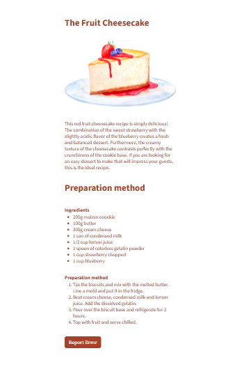
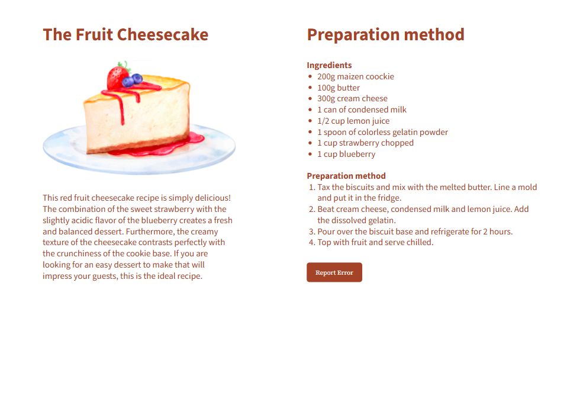

<!DOCTYPE html>
<html lang="pt-BR">
<head>
  <meta charset="UTF-8">
  <meta name="viewport" content="width=device-width, initial-scale=1.0">
</head>
<body>
  <header>
    <h1>Cheesecake</h1>
    

      Screen created with mobile first principle for styling training.
    

  </header>

  <section>
    <h2>Screen Mobile</h2>
    
  </section>
  
  <section>
    <h2>Screen Web</h2>
    
  </section>
